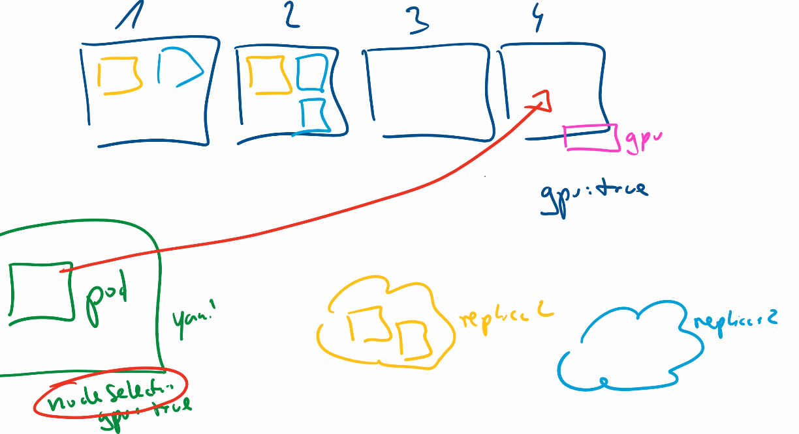

# Kubeproxy

kubeproxy -> greift auf iptables (oder nftables) -> Umleiten

iptables:

* any(source) -> 10.96.0.128 (Desitination) + Port (80) / sollst dieses Abfangen

Destinationnat / DNAT mit zwei Einträgen (als Beispiel):

* Ändere 10.244.1.200
* Oder 10.244.2.200

Er entscheidet sich für 10.244.2.200 -> Record getroffen wurden

<figure><figcaption></figcaption></figure>

Als Beispiel wurde jetzt die D. auf diesen Record angepasst

<figure><figcaption></figcaption></figure>

CNI weiss wo welche IP Range wo gültig ist und das wird vermieden.

Die CNI's tauschen die Informationen aus dafür.

ip route

* 10.0.0.0/24 -> eth0
* 10.244.1.0/24 -> "Local/cli"
* 10.244.1.0/24 -> flannel1

